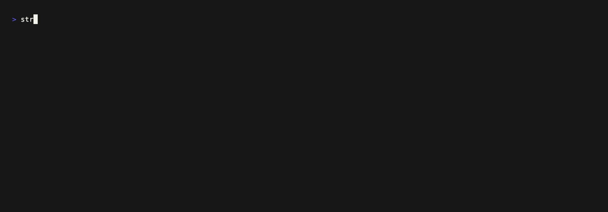

# Stringproof

Stringproof checks Apple `.strings` catalogs for damage introduced during translation. It reports problems but never translates or changes a file.



## Install and use

Stringproof requires Python 3.10 or newer and has no runtime dependencies. The same zipapp runs on macOS and Linux, on x86-64 and ARM64.

```bash
curl -fsSL https://workcell-137.pages.dev/stringproof/install.sh | sh

stringproof check ios --source-locale en
```

Or tell your agent:

```text
install https://workcell-137.pages.dev/stringproof/llms.txt
```

With no findings, Stringproof prints nothing and exits `0`. Use `--json` for agents, hooks, and CI:

```bash
stringproof check ios --source-locale en --json
```

## Try it

```bash
stringproof check stringproof/fixtures/corrupted --source-locale en
stringproof check stringproof/fixtures/clean --source-locale en
```

The first command prints findings and exits `1`. The second prints nothing and exits `0`.

## What it checks

- Catalog syntax, duplicate keys, and missing or unexpected keys
- Missing or added printf, ICU, and Swift placeholders
- Replacement characters, common mojibake, prompt residue, unexpected scripts, and suspicious unchanged text

Stringproof finds catalogs under `<locale>.lproj/*.strings`, pairs source and target files by relative path, and compares their contents. Human findings use this form:

```text
path:line [code] locale key: explanation
```

JSON contains the same findings with stable codes, severity, paths, lines, locales, keys, messages, and summary counts.

Script checks use Unicode 17 `Script`/`Script_Extensions` data and CLDR 48.2 likely scripts. Shared punctuation is ignored, BCP 47 script subtags take precedence, and retained Latin names or technical terms are treated conservatively.

## Limits

Stringproof can show that catalogs line up and that known corruption patterns are absent. It cannot show that a translation is correct, natural, or appropriate.

Its language checks are heuristics. A legitimate unchanged name may be flagged. Source text with a small alteration may be missed. An entirely missing target catalog is not detected because Stringproof has no configured list of expected locales. One unreadable catalog stops the check.

Stringproof supports Apple `.strings` only. It does not read `.xcstrings`, `.stringsdict`, JSON catalogs, source code, or Git diffs. It has no configuration or repair mode.

## Exit codes

- `0` — clean
- `1` — findings
- `2` — invalid invocation, unreadable input, or internal failure

## Why a CLI

A CLI gives people and automation the same interface without a server or protocol integration. Stable JSON and exit codes are the agent contract. Stringproof stays local, read-only, and separate from translation and repair.

## Development

```bash
make stringproof-test
make stringproof-recording
```

Regenerate the bundled Unicode tables only when updating their pinned versions:

```bash
python3 stringproof/tools/generate_unicode_data.py
```
