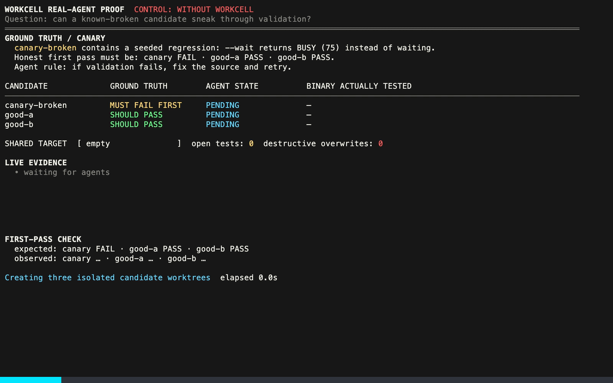

# Workcell

Workcell is a host-local FIFO queue for Macs, phones, GPUs, rigs, and license seats shared by coding agents.



## Install and use

```bash
curl -fsSL https://workcell-137.pages.dev/install.sh | sh

workcell run macos-xcode --wait -- xcodebuild test
```

Or tell your agent:

```text
install https://workcell-137.pages.dev/llms.txt
```

## Try it

Compare the same three-agent validation with and without Workcell:

```bash
curl -fsSL https://workcell-137.pages.dev/demo.sh | sh
```

## Commands

```text
workcell run <resource> [--wait] [--session <id>] [--json] -- <command...>
workcell status <resource> [--json]
```

- `resource` is the exact queue key; use one canonical name for each shared capability.
- `--wait` joins the FIFO queue. Without it, a busy resource exits `75`.
- `--json` emits one result on stdout, writes command output to `log_path`, and includes `owner`, `queue_ahead`, and `next_action.wait_argv` when busy.
- `--session` or `WORKCELL_SESSION` identifies the caller.

## Agent contract

A busy JSON result looks like this:

```json
{
  "schema_version": 1,
  "resource": "macos-xcode",
  "decision": "busy",
  "owner": {
    "reservation_id": "01K...",
    "session": "agent-a",
    "actor": "agent",
    "host": "build-mac",
    "pid": 7312,
    "repository": "workcell",
    "branch": "main",
    "cwd": "/src/workcell",
    "command": "xcodebuild test",
    "started_at": "2026-08-03T14:18:40Z",
    "elapsed_seconds": 12.418,
    "log_path": "/Users/runner/.local/state/workcell/logs/01K....log"
  },
  "queue_ahead": 0,
  "next_action": {
    "kind": "wait_or_continue",
    "wait_argv": [
      "/usr/local/bin/workcell", "run", "macos-xcode", "--wait",
      "--session", "agent-b", "--json", "--", "xcodebuild", "test"
    ]
  }
}
```

The agent can execute `wait_argv` unchanged, inspect the owner's log when relevant, or continue unrelated work. Completed results include the reservation, timings, log path, and wrapped command exit code.

State is stored under `~/.local/state/workcell`. Set `WORKCELL_STATE_DIR` to override it.

Workcell coordinates cooperative callers on one host. It is not authorization, preemption, discovery, scheduling, or distributed locking.

## Origin

Workcell grew out of Pixel Brite, where parallel agents competed for a Mac and its simulators, an RTX 4090, and memory-constrained build hosts. A homegrown lease spread across several scripts worked well enough that I used coding agents to turn the pattern into Workcell.

The tradeoff is cooperation: agents must follow a few lines in `AGENTS.md`. Those instructions can be lost during context compaction or ignored, but the protocol has been reliable enough for my normal workflow.

## Development

```bash
make workcell-test
make demo
make multi-demo
make proof
```
